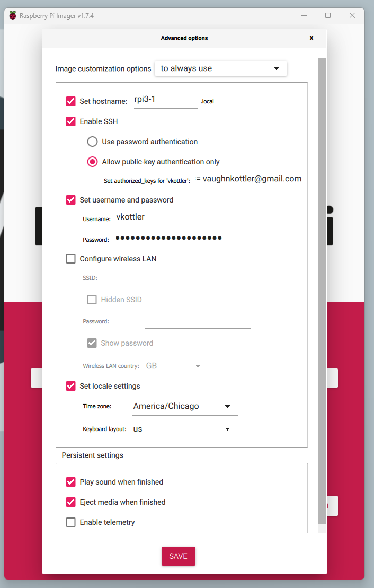

# raspberrypi

1. Run `winget rpi-imager` in PowerShell to install the tool.
1. Open "Raspberry Pi Imager" via Start Menu (search for it).
1. Choose "Raspberry Pi OS Lite (64-Bit)" in "Raspberry Pi OS (other)" menu
*(Note: use 32-Bit for Raspberry Pi 2 or earlier)*.
1. Choose your SD Card (use at least a 16 GB card).
1. Adjust some settings so you can SSH in as your current user, and with your
current SSH key pair:



A recommended naming convention would be `rpi{revision}[letter]-{instance}`,
where you increment `{instance}` for each instance of that kind of Raspberry Pi
you are provisioning (note: you will want to label the unit as well!).

6. Press "WRITE", accept data loss, wait for writing to complete.
6. Remove the card when complete, install card in unit, power unit with monitor
and an Ethernet connection connected to you home network.
6. Wait for unit to fully boot up (it may reboot 1-2 times), and confirm you
can `ping` it with: `ping <hostname>`, where `<hostname>` is the option you
provided for the "Set hostname:" advanced option.
6. Add your SSH key pair to it with `add_ssh_keys.sh <hostname>` and confirm
this is successful.
6. SSH onto the device with `ssh <hostname>`.
6. Run: `curl https://raw.githubusercontent.com/project-81/workspace/master/scripts/raspberrypi/bootstrap.sh -sSf | sh`.

*Note: the above steps can be done all at once with
[provision.sh](provision.sh) in this directory.*

## Notes

Trying to install this: https://github.com/dorssel/usbipd-win

Had to restart Terminal to get `usbipd` to be available on PATH.

https://github.com/dorssel/usbipd-win/wiki/WSL-support

```
usbipd wsl attach --distribution openSUSE-Tumbleweed --busid 1-24
```

getting client: https://software.opensuse.org/download/package?package=usbip&project=network

https://github.com/microsoft/WSL/issues/7770#issuecomment-1140443247

Down a rabbit hole of re-building WSL 2 kernel.
